---
html:
  embed_local_images: true
  embed_svg: true
  offline: true
  toc: true

print_background: false
export_on_save:
  html: true
---

## `try04_1D_carpet_N=3.ipynb`
- 1D chain, N=3
- Fixpoint stability illustrated by quiver plot. Axes: 1st and 2nd cilium phase. (3rd cilium phase is deduced from Poincare plane equation)

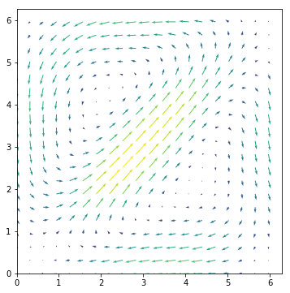

## `try05_1D_carpet_find_fixpoint.ipynb`
- Develop a procedure to find fixpoints

## `try06_2D_find_fixpoint.ipynb`
- Find fixpoints for 6x6 triangular lattice.
- No classes yet.

### Find fixpoint procedure
- Tested in `try09` N=6:
  - Keep `tol=mini_tol`
  - Find first lower tolerance result and use it later as initial condition for higher tolerance procedure.

## `try07_CARPET_optimize_friction.ipynb`
- Use `carpet` package
- Optimize & test friction computation
- Classes
- Recalculated fixpoints with `tol=10 ** -8`
### Classes procedure
- Tested in `try09`: N=6 k1=1, perturbing one node is exactly equivalent to N=30, k1=5, perturbing the whole symmetry class.

## `try08b_CARPET_fixpoint_analysis.ipynb`
- Version b: use fixpoints from `try07` rather than `try06`

- Stability of fixpoints

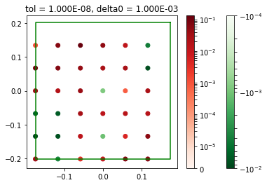

Slightly different result for different delta0.

- Look closely at eigenvectors and eigenvalues:
  - at slowest and fastest decaying modes

## `try09_1D_carpet_analysis_N=6.ipynb` (and `try09` `a` `b` `c` ) and also `try08b`
- Found fixpoints with `tol=10 ** -6`
### Eigenvectors
- Stored as **columns** of NxN array `evecs`
- Normalized
- Not orthogonal in general, but a lot of them *are* orthogonal
- There are eigenvectors which are complex conjugates of one another (which is what we expect for complex eigenvalues).
- Perturbation made of eigenvector and its complex conjugate will develop after a cycle as predicted to linear theory up to precision of `10 ** -4` - `10 ** -5`.
  - This is not very small, but it remains as small if I increase `delta0` to `10 ** -1`
  - Imaginary part of eigenvalue gives very small contribution.
- Most of eigenvectors have their components lying on a circle - which is often shifted away from origin.

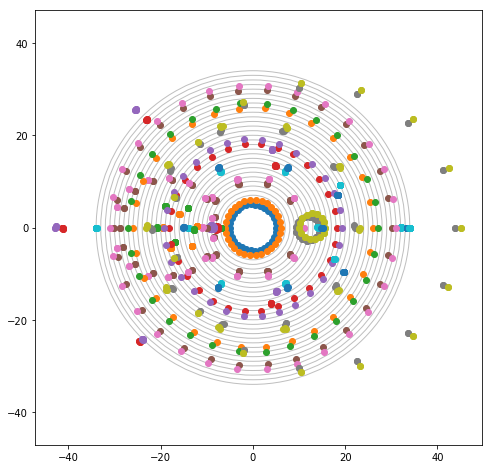

- Eigenvector representation:
$$
\Delta = c + r e^{i \Phi_k} e^{i \theta}
$$
    - centers $c$ are located on or close to real axis; and they are distributed symmetrical around real axis.
    - Eigenvectors which are complex conjugates of each other have their centers complex conjugated as well.
    - Most of eigenvectors seems to have this form, but there is some noise, plus a couple of examples where points are very much off: N=30, k1=1, ievec=13-16

#### More detailed eigenvector representation
- More precisely - decompose eigenvector into basis of complex exponents of m-twists:
$$
\Delta = \sum_{\mathbf{k}} d_k e^{i \Phi_\mathbf{k}},
$$
with only two major components: $\mathbf{k}=\mathbf{0}$ and $\mathbf{k}=\mathbf{k_1} \neq \mathbf{0}$,

$$
\Delta = d_0 +  d_{\mathbf{k_1}} e^{i \Phi_\mathbf{k_1}}  +\mathbf{R},
$$

where $\mathbf{R_2} = \sum_{\mathbf{\mathbf{k} \neq \mathbf{0}, \mathbf{k_1}}} d_k e^{i \Phi_\mathbf{k}}$ - residual.

- In most of the cases $\lVert \mathbf{R_2} \rVert < 0.02$. In a few cases $ 0.02 < \lVert \mathbf{R_2} \rVert < 0.1$ and taking one additional term would lower the residual down to $ 0.02$.

### Eigenvalues
- Stable region looks seems to stay persistent between N=30 and N=120
- $N=6$
  - Does not visually depend on $\delta_0$

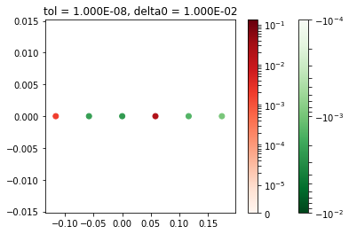

- $N=30$
- much weaker stability regions, especial with $\delta_0 = 10^{-3}$. More ways to perturb compared to $N=6$ => weaker stability.

$\delta_0=10^{-3}$
 - Different from bigger $\delta_0$!
 - Different tolerance -> consistent

- $N=120$

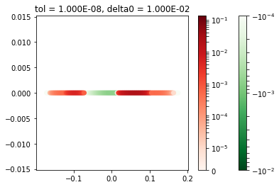
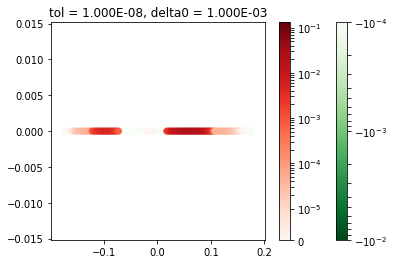

- $N=30$, finer fixpoints: with `tol = 10 ** -8`
  - Plots changed, but only slightly.
  - We can be confident that the stable solutions have very slow decaying modes.

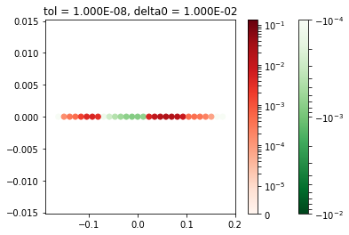
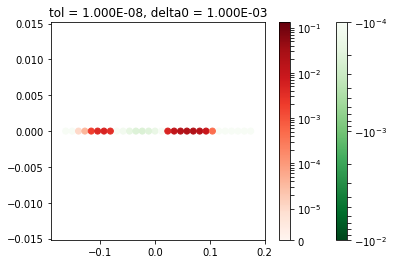

- $N=30$ - finer fixpoints. other delta0s:

Note: from two cilia analysis: for qualitative estimates `tol = 10 ** -8` and `delta0=0.01` might be sufficient. If we go to `delta=0.001` we might want to change tolerance to `tol =` `10 ** - 9` - `10 ** - 10` (depend on interaction strength)

Therefore
- in this configuration cilia are coupled weaker, than if they are located on the same distance, but a different direction
- `delta0` around `10 ** -3` was used.

- TODO: chain of cilia in a different direction?
- TODO: maybe switch to `tol=10 **-10` and `delta0=0.001` like in two cilia case? But then we have much worser tolerance in fbem and fixpoints.. does it make sense to do that?
- TODO: finer fixpoint tolerance? - calculating..

### Eigenvalues magnitude vs eigenvector length in dual lattice space
Observed a generic behaviour:
- Imaginary parts grow (almost) linearly toward the medium-length of eigenvectors
- Real parts grow (in absolute value) towards longer vectors

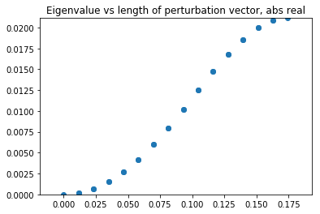
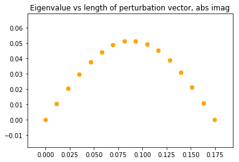

**UPD:** nice plot - now $k$ has sign (since it's 1D that's easy); real and imaginary parts are also with sign now:

- imaginary part is an odd function
  **UPD**: N=6: k1=1 - >1% difference => either not exactly odd, or there is just strong numerical noise

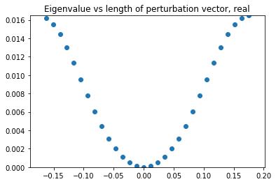
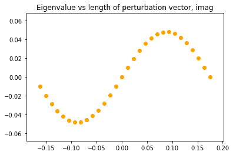

- Can be fitted very well with $\sin(a  k)$, where $a$ - is the lattice spacing.
- Can fit $1 - \cos(a k)$ to the real part. Not as nicely, but still very good

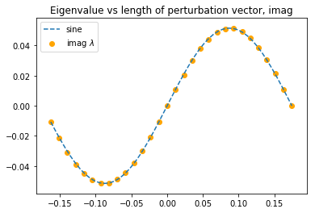
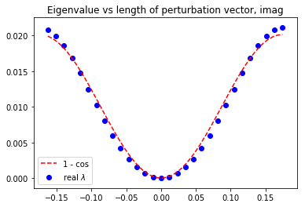

### b: N=30
- Experimental: Consider a different x axis: 1/k
- extra precision fixpoitns (`tol = 10 **-8`)
- extra delta0s: compare eigenvalues
  Result:
  - error around `10 ** -4` - it's OK, but can't trust small values - big relative error
  - OK: sanity check - compare `abs` instead of only real part.
  - NOT OK: eigenvectors?
- Compare eigenvalues vs eigenvector length in dual lattice space.
- Eigenvectors decomposition to the basis of complex exponents of m-twists (<=> discrete fourier transform)

### c: N=120

## `try_10_fixpoint_new_procedure.ipynb`
- Unsuccessful

## `try12_1D_carpet_rotated.ipynb`
- Rotated chain of cilia
- `a`, `b` `c` - different rotation angle

### Largest eigenvalues plotted in dual lattice space
- Longer vector $k$ <-> smaller wave length.
- `psi=30`, `psi=-30`,  `psi=0`, `psi=90` (from `try09b`)

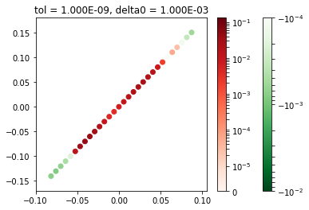
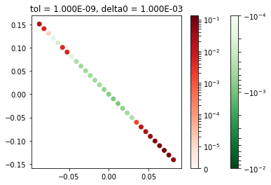

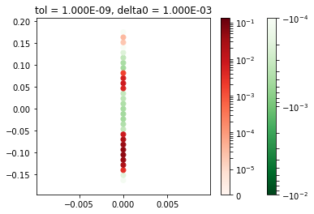

- The fastest decaying m-twist:
  -  `psi=-30`, `psi=30`:  `8 * 10 ** -4` (real part of the biggest eigenvalue, except 0)
  - `psi=90`: `2 * 10 ** -4`
  - `psi=0`:  `5 * 10 ** -4`

### `a`: `psi=30`

- Map eigenvectors to m-twists.
 Plot eigenvalue vs length of k (multiplied by sign - e.g. sign of x-component).
- Real parts are nicely fitted nicely with 3-parameter linear fit in basis $\{1, \cos(a  k), \cos(2  a  k)\}$
- Moreover, in all the cases checked it can be reduced to one parameter:
  - $c  (1 - \cos(a k))$
  - $c  ( \cos(a k) - \cos(2 a k)$

- Imaginary part is fitted by $\sin(a k)$

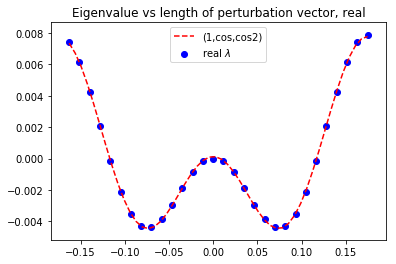
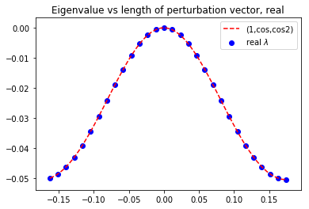

## `try11_carpet_analysis_nx=12_ny=12.ipynb`
- Redo `try08b` for a larger carpet with triangular lattice

### Questions
- Stability regions
- Map eigenvectors to m-twists
  - Is it possible? How big are residuals?
  - Eigenvalues vs k
