---
html:
  embed_local_images: true
  embed_svg: true
  offline: true
  toc: true

print_background: false
export_on_save:
  html: true
---


## `try04_1D_carpet_N=3.ipynb`
- 1D chain, N=3
- Fixpoint stability illustrated by quiver plot. Axes: 1st and 2nd cilium phase. (3rd cilium phase is deduced from Poincare plane equation)


## `try05_1D_carpet_find_fixpoint.ipynb`
- Develop a procedure to find fixpoints

## `try06_2D_find_fixpoint.ipynb`
- Find fixpoints for 6x6 triangular lattice.
- No classes yet.

### Find fixpoint procedure
- Tested in `try09` N=6:
  - Keep `tol=mini_tol`
  - Find first lower tolerance result and use it later as initial condition for higher tolerance procedure.

## `try07_CARPET_optimize_friction.ipynb`
- Use `carpet` package
- Optimize & test friction computation
- Classes
- Recalculated fixpoints with `tol=10 ** -8`

### Classes procedure
- Tested in `try09`: N=6 k1=1, perturbing one node is exactly equivalent to N=30, k1=5, perturbing the whole symmetry class.

## `try08b_CARPET_fixpoint_analysis.ipynb`
- Version b: use fixpoints from `try07` rather than `try06`

- Stability of fixpoints


Slightly different result for different delta0.

- Look closely at eigenvectors and eigenvalues:
  - at slowest and fastest decaying modes

- Plot
## `try09_1D_carpet_analysis_N=6.ipynb` (and `try09` `a` `b` `c` ) and also `try08b`
- Found fixpoints with `tol=10 ** -6`
### Eigenvectors
- Stored as **columns** of NxN array `evecs`
- Normalized
- Not orthogonal in general, but a lot of them *are* orthogonal
- There are eigenvectors which are complex conjugates of one another (which is what we expect for complex eigenvalues).
- Perturbation made of eigenvector and its complex conjugate will develop after a cycle as predicted to linear theory up to precision of `10 ** -4` - `10 ** -5`.
  - This is not very small, but it remains as small if I increase `delta0` to `10 ** -1`
  - Imaginary part of eigenvalue gives very small contribution.
    - **UPD**: Small; even when normalized by ||Delta1 - Delta0||: `10 ** -3`
- Most of eigenvectors have their components lying on a circle - which is often shifted away from origin.


- Eigenvector representation:
$$
\Delta = c + r e^{i \Phi_k} e^{i \theta}
$$
    - centers $c$ are located on or close to real axis; and they are distributed symmetrical around real axis.
    - Eigenvectors which are complex conjugates of each other have their centers complex conjugated as well.
    - Most of eigenvectors seems to have this form, but there is some noise, plus a couple of examples where points are very much off: N=30, k1=1, ievec=13-16

#### More detailed eigenvector representation
- More precisely - decompose eigenvector into basis of complex exponents of m-twists:
$$
\Delta = \sum_{\mathbf{k}} d_k e^{i \Phi_\mathbf{k}},
$$
with only two major components: $\mathbf{k}=\mathbf{0}$ and $\mathbf{k}=\mathbf{k_1} \neq \mathbf{0}$,

$$
\Delta = d_0 +  d_{\mathbf{k_1}} e^{i \Phi_\mathbf{k_1}}  +\mathbf{R},
$$

where $\mathbf{R_2} = \sum_{\mathbf{\mathbf{k} \neq \mathbf{0}, \mathbf{k_1}}} d_k e^{i \Phi_\mathbf{k}}$ - residual.

- In most of the cases $\lVert \mathbf{R_2} \rVert < 0.02$. In a few cases $ 0.02 < \lVert \mathbf{R_2} \rVert < 0.1$ and taking one additional term would lower the residual down to $ 0.02$.


#### Decomposition of fixpoints
- Decomposition of a complex exponent of a fixpoint posesses some symmetries, e.g. look at the decomposition of 5-twist:
```
i    real          imag
0    -0.00181      -0.000718
5    1             2.63e-06
10    0.00181       -0.000718
15    0.000344      -3.81e-05
20    1.19e-06      -0.000345
25    -0.000342     -3.68e-05
```
  Real parts of additional contributions have opposite sign.
 - 0-twist is paired with 2*k-twist, if we decompose k-twist!
  - EXPLANATION: complex exponent of a real function => symmetries
    For more - look into decomposition $\exp(i \Delta^*)$, where $\Phi^{*}_k = \Phi_k + \Delta^*$

### Eigenvalues
- Stable region looks seems to stay persistent between N=30 and N=120
- $N=6$
  - Does not visually depend on $\delta_0$


- $N=30$
- much weaker stability regions, especial with $\delta_0 = 10^{-3}$. More ways to perturb compared to $N=6$ => weaker stability.


$\delta_0=10^{-3}$
 - Different from bigger $\delta_0$!
 - Different tolerance -> consistent


- $N=120$


- $N=30$, finer fixpoints: with `tol = 10 ** -8`
  - Plots changed, but only slightly.
  - We can be confident that the stable solutions have very slow decaying modes.


- $N=30$ - finer fixpoints. other delta0s:


Note: from two cilia analysis: for qualitative estimates `tol = 10 ** -8` and `delta0=0.01` might be sufficient. If we go to `delta=0.001` we might want to change tolerance to `tol =` `10 ** - 9` - `10 ** - 10` (depend on interaction strength)

Therefore
- in this configuration cilia are coupled weaker, than if they are located on the same distance, but a different direction
- `delta0` around `10 ** -3` was used.

- TODO: chain of cilia in a different direction?
- TODO: maybe switch to `tol=10 **-10` and `delta0=0.001` like in two cilia case? But then we have much worser tolerance in fbem and fixpoints.. does it make sense to do that?
- TODO: finer fixpoint tolerance? - calculating..


### Eigenvalues magnitude vs eigenvector length in dual lattice space
`try09b`

Observed a generic behaviour:
- Imaginary parts grow (almost) linearly toward the medium-length of eigenvectors
- Real parts grow (in absolute value) towards longer vectors


**UPD:** nice plot - now $k$ has sign (since it's 1D that's easy); real and imaginary parts are also with sign now:

- imaginary part is an odd function
  **UPD**: N=6: k1=1 - >1% difference => either not exactly odd, or there is just strong numerical noise


- Can be fitted very well with $\sin(a  k)$, where $a$ - is the lattice spacing.
- Can fit $1 - \cos(a k)$ to the real part. Not as nicely, but still very good


### N=6
- Found out that the matrix is not correctly compiled: has to be transposed

### b: N=30
- Experimental: Consider a different x axis: 1/k
- extra precision fixpoitns (`tol = 10 **-8`)
- extra delta0s: compare eigenvalues
  Result:
  - error around `10 ** -4` - it's OK, but can't trust small values - big relative error
  - OK: sanity check - compare `abs` instead of only real part.
  - NOT OK: eigenvectors?
- Compare eigenvalues vs eigenvector length in dual lattice space.
- Eigenvectors decomposition to the basis of complex exponents of m-twists (<=> discrete fourier transform)
- Neutral perturbation is not the same as `dphidt` (?)

### c: N=120

## `try_10_fixpoint_new_procedure.ipynb`
- Unsuccessful

## `try12_1D_carpet_rotated.ipynb`
- Rotated chain of cilia
- `a`, `b` `c` - different rotation angle


### Largest eigenvalues plotted in dual lattice space
- Longer vector $k$ <-> smaller wave length.
- `psi=30`, `psi=-30`,  `psi=0`, `psi=90` (from `try09b`)


- The fastest decaying m-twist:
  -  `psi=-30`, `psi=30`:  `8 * 10 ** -4` (real part of the biggest eigenvalue, except 0)
  - `psi=90`: `2 * 10 ** -4`
  - `psi=0`:  `5 * 10 ** -4`

### `a`: `psi=30`

- Map eigenvectors to m-twists.
 Plot eigenvalue vs length of k (multiplied by sign - e.g. sign of x-component).
- Real parts are nicely fitted nicely with 3-parameter linear fit in basis $\{1, \cos(a  k), \cos(2  a  k)\}$
- Moreover, in all the cases checked it can be reduced to one parameter:
  - $c  (1 - \cos(a k))$
  - $c  ( \cos(a k) - \cos(2 a k))$

- Imaginary part is fitted by $\sin(a k)$


## `try09v2_1D_carpet_analysis_N=6.ipynb`
- Fill `L_log_lin` column by column:

  $$ \Delta_1 = \mathbf{L} \Delta_0 =  (\Lambda + \mathbf{I}) \Delta_0 $$

  If $\Delta_0 = (\delta_0,0,0,..)$, then the first column of $L$ = $\Delta_1 / \delta_0$. But before in code, we fill the matrix row by row?! -
- Results have not visually changed
- Introduce a different set of perturbations with zero mean phase.
- Test how much non-additive and inhomogeneous is the Poincare map (continued in `try13`


## `try13_1D_chain_test_linearized_map.ipynb`

#### Fixpoints accuracy
##### 1. How far is the image of the Poincare map located from the preimage?

  Plot $|| \mathcal{L}(\widetilde \Phi^*) - \widetilde \Phi^*||$ as a function of `tol`

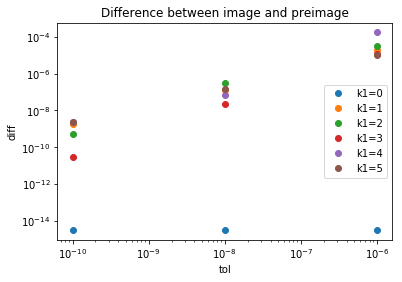

##### 2. Estimate how far we are from the real fixpoint.

   Plot $|| \widetilde \Phi^*(tol) -  \widetilde \Phi^*(10^{-10})||$ as a function of `tol`

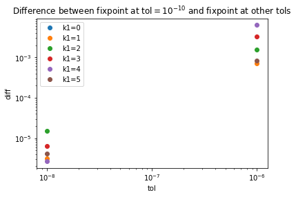

**Result**

1.
    -  Distance between image and preimage is 1-2 orders of magnitude bigger than `tol`
    -  The absolute deviation in tests of Poincare map linearity is of the same order as
      $|| \mathcal{L}(\widetilde \Phi^*) - \widetilde \Phi^*||$

2.  Distance to the presumable fixpoint - 3 orders of magnitude bigger than `tol`!
     (e.g. `tol=10**-8` distance `= 10 ** -5` => in mean squared sense, each coordinate deviates by `4 * 10 ** -6`)


- (Normalizer) All deviation except very big one (`delta0=1`) showed the same ratio between   $||\Delta_1 - \Delta_0||$ and $||\Delta_0||$. Perturb by a simple in-section perturbation
  - depending on `k1`: `4 * 10 ** -3` - `10 ** -2`
- Estimate how much inaccuracy in fixpoint will affect linear approximation: OK

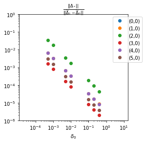

#### Trajectory tangent
- dphidt deviates from constant phase shift by 0.5% (max component-wise)
- Perturb by vector (1,1,..1) => perturation is essentially neutral:
  $||\Delta_1 - \Delta_0||$~ $10 ^{-7}$
- Pertrub by dphidt - also, cant see a difference

#### Non-additivity and non-homogeneity

- Errors come from inpurity of the fixpoint. The only way to fix it
  - Find finer fixpoint
  - Have a system with stronger interactions (then we would normalize by a bigger quantity)
- If we don't do it, we have high inhomogenity:
   - By fitting the best linear term - 5% error
   - Smaller error (1%) if we the perturbation is proportional to an m-twist.
- Pick `delta0=5 * 10 **-3`. Or do a fit across several `delta0s`

- Checked: (1,1,1,1..1) - neutral perturbation up to a error, caused by fixpoint inaccuracy (probably ~ $\Delta_*$

#####  Non-additivity of Poincare map
- "Sweetspot" - local minimum of the relative deviation as a function of `delta0`
- At `10 ** -10`: it's at `delta0 = 10 ** -3` or even smaller (need more points).
- At `10 ** -8`: it's at `delta0 = 5 * 10 ** -3`
- OK: scaling
- Additional error kicks in at low delta0: already at `~10 ** -3` (Expected by analytics)

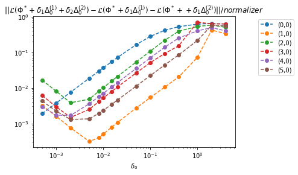

##### Non-homogenity of Poincare map: linear fit vs Poincare map, normalized by  $||\Delta_1 - \Delta_0||$

- NOT OK? k1=0,2  => high deviation
  - Can improve fit by using a smaller delta0 interval => error is bound by 5%
- OK: scaling v1 (no fit): deviation scales linearly
  - v2: when we fit, we don't see linear scaling

- NOT OK? error starts to grow too early at low delta0s
  - Also due to fitting - it tends to fit better a point in the middle, so the error on lower/higher `\delta_0` will grow.


 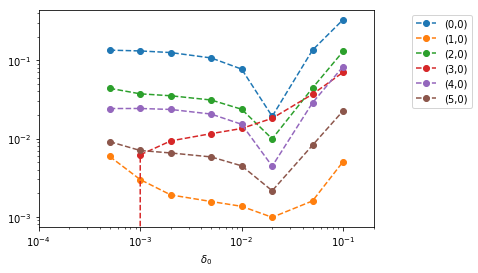

- Different control points

 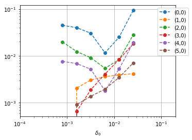


 - Perturbed my cosine of an m-twist: inhomogeneity 1 order smaller than in case of 1 node perturbed (+ other nodes corrected the same way to maintain global phase)s

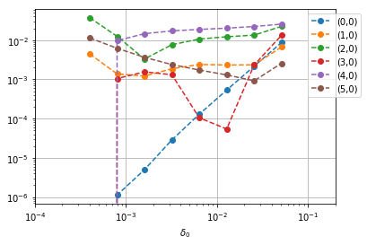

##### New linearized Poincare map (truncated)
  - NOT OK? Compared the the old one: have the same eigenvalues, but eigenvectors can come in different order

#### New linearized Poincare map (v3)
- Tested: (1,1,1..1) = neutral perturbation up to error, caused by inaccuracy in fixpoint
- Construct L by single-node or cos/sine of mtwist perturbations
- Both single node and mtwist perturbations coincide or very close to old eigenvalues, mapped to the same k.
- OK: eigenvalues are almost always the same
- Eigenvalues differ, when they are small by absolute value. In this case mtwist-eigenvalue showed better linear approximation to the nonlinear Poincare map

#### Linearized map by fitting
- Compute Delta1s and different delta0s -> find the best linear approximation by fitting.

#### L_log_lin vs L - I: how much do eigenvalues differ?
- Calculate eigenvalues of L and take log; vs eigenvalues of L - I
- Differs up to 20% in real part (2% in abs value)
  - This happens when real part ~ `5 * 10 ** -3`, imag ~`4 * 10 ** -2`
- in abs values - differs by just a few percent - still we would prefer to avoid it


#### Are eigenvectors more noisy if eigenvalues are small?
**new**

- Yes, but the correlation is relatively weak. Pearson: `(-0.45563968170028285, 2.44879205131547e-47)`

  Plot residual of decomposition (square root of squares of abs values of all coefficients, except the biggest one) against abs eigenvalues.

  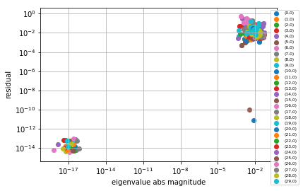

  Zoom in

  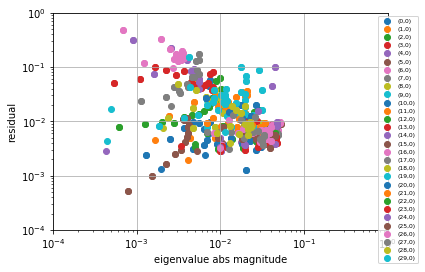

  Plot against max abs eigenvalue  for a given fixpoint

  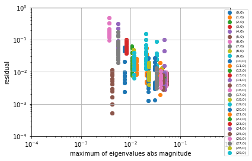

**old**

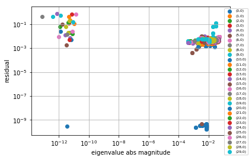

Zoom in: no correlation (but there are a couple of outliers)

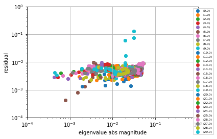

#### Updated procedure to find fixpoints
- Preserve mean phase
- Slower: 2 times if truncate, 10% if end only at mean_phase=0.

### `try13b`

#### Test: When calculating L matrix; subtract Poincare image of a fixpoint, instead of the fixpoint itself.
- k1=5:
   - the same plot ev vs k.
   - Many eigenvalues the same up to machine precision; some up to 10 ** -6, one (real e.v.) up to 10**-5
- k1=19:
   - The same eigenvalues up to 10 ** -5
   - Plot ev vs k looks less noisy (yet not a perfect 1 - cos)
   - Seemed like imaginary parts of eigenvalues differed much, but it was due to unordered imaginary parts of eigenvalues.
- CONCLUSION: can use old version; perhaps the new one can give advantage when eigenvalues are very small; but do we need it?

## `try12v2_1D_carpet_rotated_psi=*_N=*.ipynb`
#### Goals
- Redo analysis from `try12` after a fix in old eigenvalues.
- Introduce a new eigenvalue computational procedure (m-twist-like perturbations)
- Largest eigenvalues plotted in dual lattice space
- Eigenvectors mapped to mtwists -> eigenvalues plot in dual lattice space
- Compare with old results

#### Largest eigenvalues plotted in dual lattice space

- Just small differences compared to old eigenvalues at `delta0=10 ** -3`

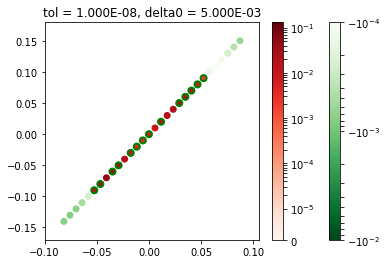
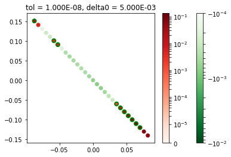


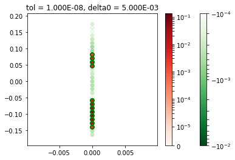


- $\psi=90$: new vs old
  - New: maximum real part of eigenvalues is smaller.


  **new**


  **old**

  

  - But if we look at eigenvalues at some fixpoint - they will change more smoothly in new case. In the old one there was a jump.
   Therefore I trust new eigenvalues more.

  **k1=1**

  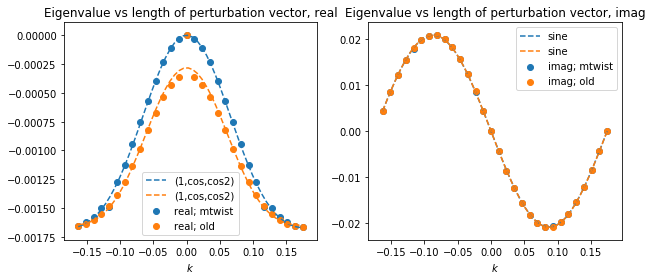

### Eigenvalues visualization: new version
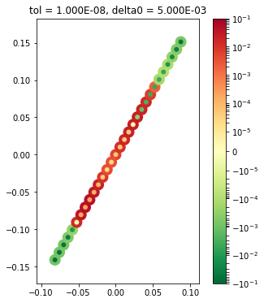

### `12v2a` `psi=30`
- Perturbation strength vs inhomogeneity;  too big
  (single-node)

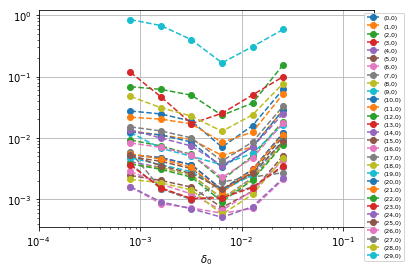
  (mtwist)

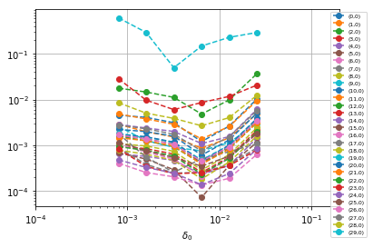

- Quite big, but better in case of mtwist perturbation


#### Propagate fixpoints to the same Poincare plane: mean phase = 0
- Eigenvalues are very close! Difference up to `10 ** -6`


## `try11_carpet_analysis_nx=12_ny=12.ipynb`

### Questions
- Stability regions
- Map eigenvectors to m-twists
 - Is it possible? How big are residuals?
 - Eigenvalues vs k


- Redo `try08b` for a larger carpet with triangular lattice

- Distance between fixpoints found with 2 different tolerance is relatively high.
  **UPD:** fixpoints don't always have zero mean phase! And it's not just 2pi jumps.

  TODO: restrict to zero mean phase => 1 less degree of freedom for the optimisation procedure.

  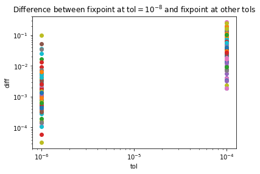

- Distance between a fixpoint and its Poincare map image

  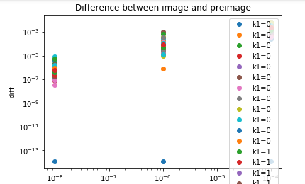


### Stability regions (Outdated: see update below)

- Even when stable - eigenvalues are quite small (old eigenvalues, `delta0=0.001`)

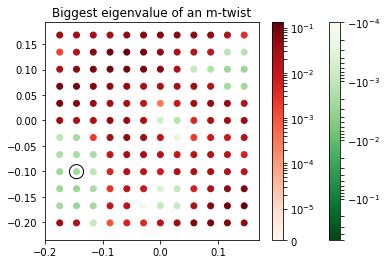

- UPDATED
  - mtwist (left) old (right)

  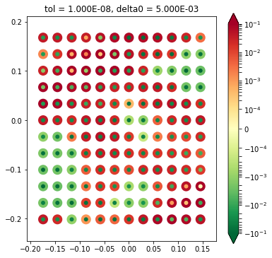
  


### Eigenvalues vs k: 2D (Outdated: see update below)
- Pick a fixpoint; map eigenvectors to k (mtwists; visualize eigenvalues vs k

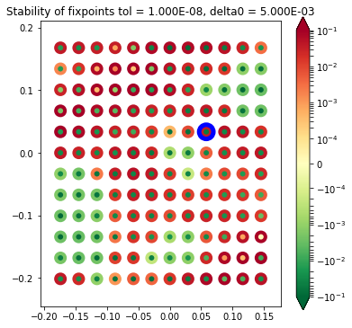


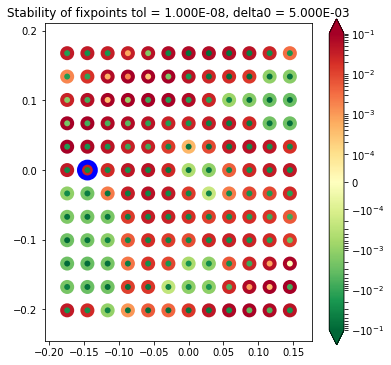
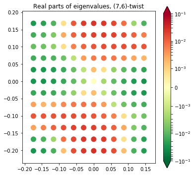


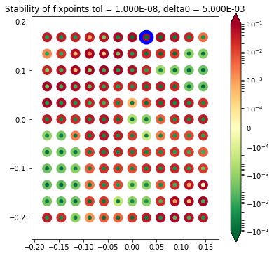
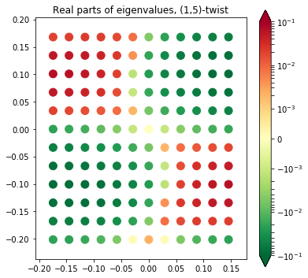

 Look at an unstable fixpoint: negative eigenvalues in the direction of stable fixpoints


### Eigenvalues vs k (Outdated: see update below)
- new - mtwist (old is the same)

  Cosine-like pattern in real part; Sine-like pattern in imaginary part (but with higher harmonics!)

 Plot: (7,3)-twist

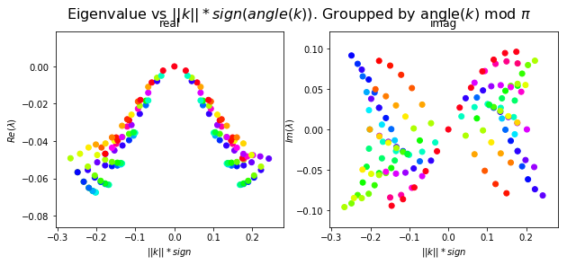

 Plot: (5,0)-twist

 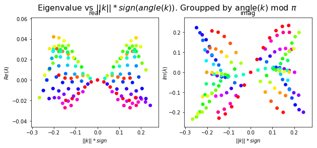

 Plot: (0,0)-twist

 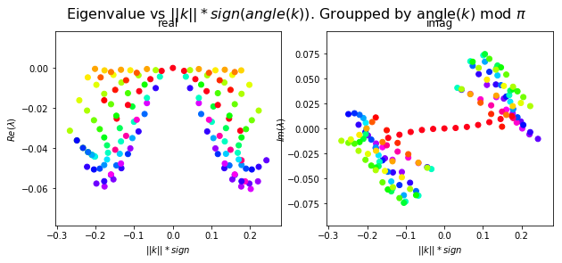

### UPD: plotting eigenvalues of log(L) instead of eigenvalues of (L-I) (first introduce in `try14b`

#### Stability regions
Modenumbers map


After/before update (left/right):

  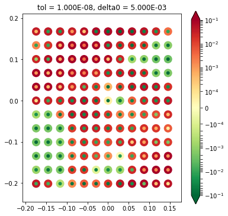
  

#### Eigenvalues vs k: 2D  - perturbation vec in the dual lattice space

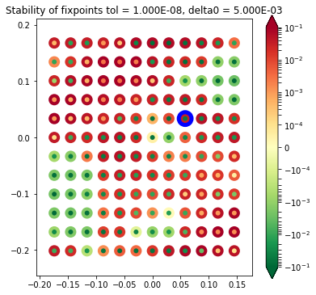


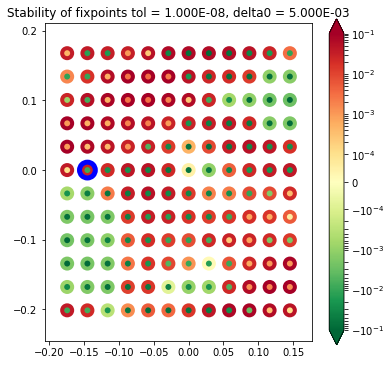
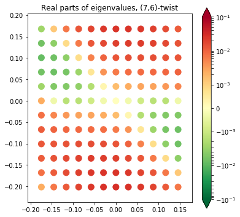

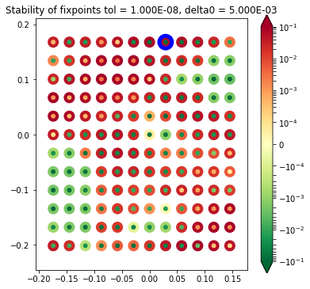
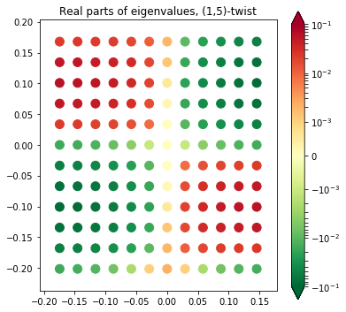

#### Eigenvalues vs k
- The ones which I plotted before didn't change visually
- Plot the same oens, as plotted on 2D plots above:

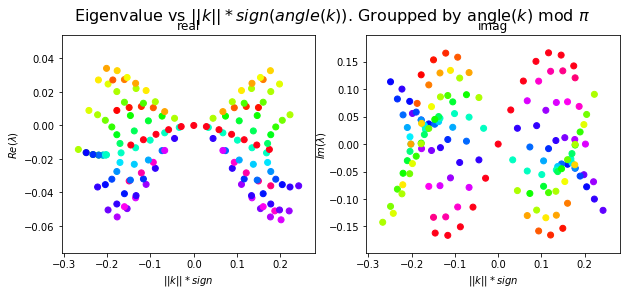
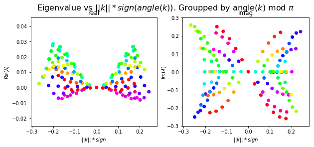

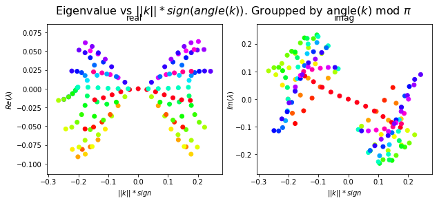

#### Change of period

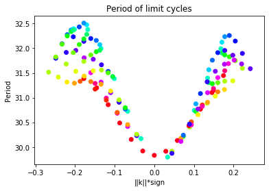
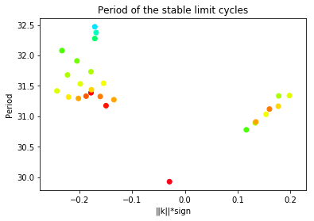

### `try11b`: rotated lattice
- Rotated lattice: lattice2
- Stability domains have changed
- distance from a fixpoint to m-twist: circstd vs rms - equivalent, distance up to 0.03

- `T` -> `period`
- Eigenvalues of `L - I` -> eigenvalues of `log(L)`
- Fixpoints with zero mean phase


### Stability plot
- Check for different `delta0`? Or better fixed points

  

- `delta0=0.01`

  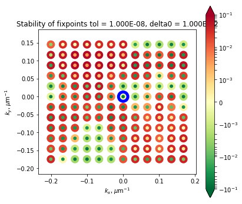

    Visually the same plot, eigenvalues are the same, up to `10 ** -4` (relative difference)
#### Period plot
- Change on the same order as in `try11`

  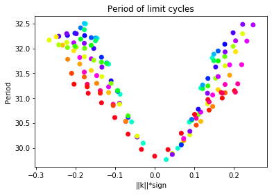

## `try14a_1D_chain_toy_coupling.ipynb`
- 1D chain
- Coupling with combination of sine and cosine
- ev vs k plot: 1 parameter fit for cosine (choose the best fit amongst two)

### `try14b_1D_chain_pure_sine_coupling.ipynb`
- Only sine coupling

- Analyse inhomogenity (how strong are non-linear terms if we increase `eps`?).

  Scales correctly (linear in alpha [second term is divided by alpha, if instead we would multiply the first term by alpha, the expression would scale quadratically])

  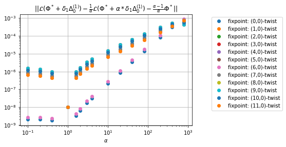

- Compare eigenvalues and time derivative with analytical approximation

Eigenvalues coincide with the ones predicted; up to `eps ** 2` term:

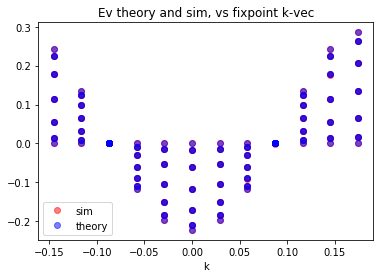

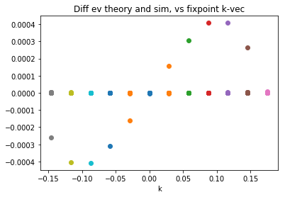

Perturb by eigenvector: compare theory vs simulation
- holds well
- Scaling: without normalizing  at 0-twist deviation scales as`eps ** 3`, at other fixpoints scales as `eps ** 2`

0-twist:
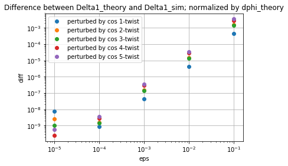

1-twist:
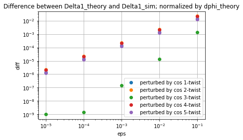


### `14c` cosine + sine coupling
- Confirms analytical calculations for eigenvalues, and frequency change.

### `14d_analyze_distance_measures`

Compare different distance measures: root mean square, sine/cosine/exp, circular standard deviation
- RMS:
  - bad: doesn't respect 2pi shifts
- RMS of `1 - cos(dphi`:
  -`1 - cos(dphi)` listed in the book
  - the same as `sin(1/2 * dphi) ** 2`
- RMS of `2 *  sp.sin(0.5 * dphi)` <-> rms of `sp.exp(1j * (phi1-phi2)) -1`
  - The same scaling as RMS
  - Distance between two fixpoints = `sqrt(2)`

- circstd vs rms:
  - Single (or several) node perturbation -> up to 30% difference; rms is bigger

    The difference is constant when normalized by rms.
  - cos(mtwist) perturbation: very good correspondence between two; diff scales as `eps ** 2`

    `eps=10**-1` => difference is around `10 ** -4`

  - Random perturbations with zero norm; difference is around `10 ** -3` at `eps=0.1`

**Therefore,**
- `circstd` gives almost the same measure as `rms` for small `dphi` **when the mean phase of dphi is zero`.
- If it's not zero, `circstd` gives a smaller distance.
- For the purposes of finding distance to a fixed point, it's safe to use `circstd`
- `circstd` also has the advantage of being a standard measure
- When phase shift is imporant, e.g. `[0, 0,1]` is different from `[-1, -1, 0]`, I can keep using RMS of `2 *  sp.sin(0.5 * dphi)` as the measure


### Basins of attractions (`14b, 14b2 14c`)

- Sine coupling vs sine+cosine coupling (left/right):
sine
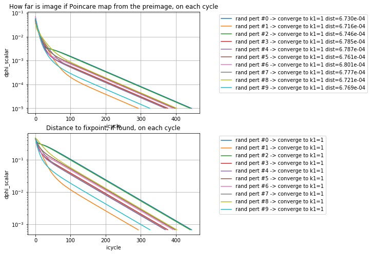

sine+cosine


Imaginary part give oscillations to dphi (||L(Phi) - Phi||)

- Pertrub near-neutral state: perturbations don't move anywhere

### `14e`, `14f`: 2D carpet; sine or sine + cosine

- Bigger eigenvalues magnitude (3x more neighbours)
  `sin_str = -0.01` => stable (0,0)-twist

   

   Sine + cosine: `sin_str = - 0.01` `cos_str = 0.01`
   Stability plot is unchanged;
   

### `14g` - sine: 12x12 carpet basins of attractions study
- Reconfirm result from `14e`: convergence to (0,0)-twist dominates
  


### `try15_compare_speed_toy_vs_cilia.ipynb`
#### Time to compute 1 cycle
-Run 100 cycles.
-Mean time spent per cycle: cilia 2.185e+00 sec, toy 1.478e-02 sec
-Cilia/toy ratio: mean 1.478e+02, std/mean 6%

### Distance in 1 cycle
-Run 100 cycles.
-Cilia circstd(L(phi0) - phi0): mean: 9.612e-02   std/mean: 1.178e-02
-Toy circstd(L(phi0) - phi0): mean: 1.098e-01   std/mean: 1.290e-02
-Cilia/toy dphi ratio mean: 8.751e-01


Therefore, almost the same distance travelled (but would also depend on coupling strength and whether we add a cosine term). Cilia nonlinear coupling is 150 times slower than sinusoidal.

Cilia:

- 1 cycle -> 1 sec
- 300 cycles -> 5 min
- 1000 trajectories -> 5000 min ~ 3.5 days
- Parallelize: 1 day on 4 cores; 2000 trajectories over weekend, assuming that 300 cycles is enough.


### `try16_2D_carpet_attraction_basins.ipynb`
- 6x6 carpet, find basins of attractions
- Dominant convergence to (3,1), then (2,1)
- If we take random phase vector; then distance to any fixed point is most likely to be more than 1
 
